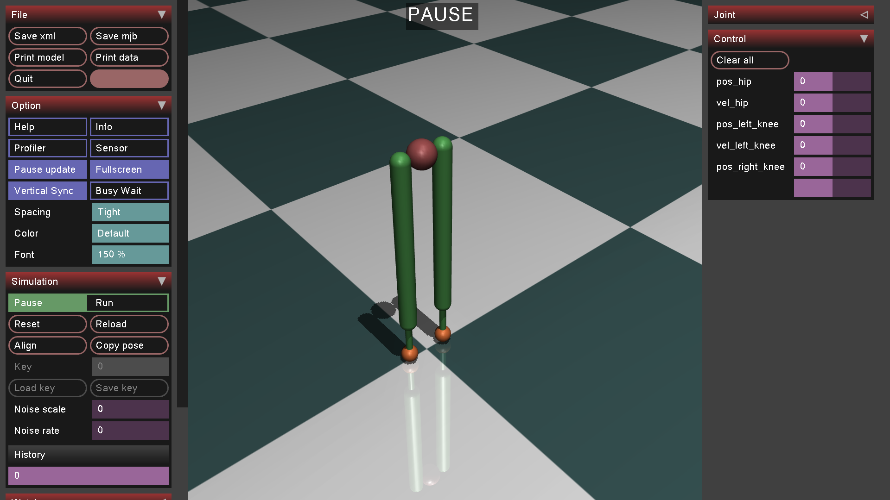
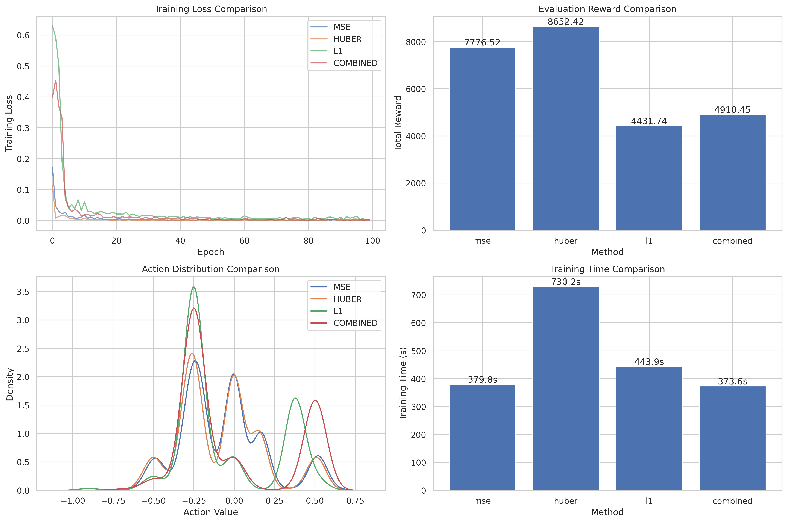

# Passive Walker RL 🏃‍♂️💨
*A three-stage, JAX-native curriculum that teaches a passive-dynamic biped to walk in ≈ 10⁵ steps — MuJoCo fidelity, Brax speed.*

---

> **TL;DR** — Three modules, **≤ 300 LoC each**  
> 1) Finite-state expert → 30 k perfect demos  
> 2) 2-layer MLP behaviour cloning (walks day-one)  
> 3) PPO fine-tuning, vectorised to **> 1 M env-steps s⁻¹**.  
> A 120-job sweep (reward-scale × LR × net size) runs in minutes on one RTX 4060 Ti and yields a smooth, disturbance-robust gait.

---

## Table of Contents
1. [Key Features](#key-features)  
2. [Quick Start](#quick-start)  
3. [Installation](#installation)  
4. [Repository Layout](#repository-layout)  
5. [Core Workflows](#core-workflows)  
6. [Reproducing Results](#reproducing-results)  
7. [Technical Details](#technical-details)  
8. [Design Choices & Notes](#design-choices--notes)  
9. [Troubleshooting](#troubleshooting)  
10. [Contributing](#contributing)

---

## Key Features

| Layer | What You Get | Why It Matters |
|-------|--------------|----------------|
| **FSM ➜ BC ➜ PPO** | Three ≤ 300-LoC stages | Easy to read, modify, and teach |
| **Rule-based demos** | 30 k expert state–action pairs in < 30 s | Rich positive *and* failure states |
| **Behaviour Cloning** | 2-layer MLP (≈ 10 k params) | “Walk-from-boot” initial policy |
| **Vectorised PPO** | Clip + GAE, critic split, BC penalty β(t)→0 | Reaches stable gait in **10⁵ steps** (5× faster than scratch) |
| **MuJoCo ⇄ Brax** | One-click MJCF → `System.pkl.gz` | Contact fidelity *and* 100× rollout speed |
| **Speed** | 128–1024 envs at < 50 µs env⁻¹ | **> 1 M env-steps s⁻¹** on RTX-class GPUs |
| **120-Job Sweep** | reward-scale × LR × net depth × seeds | Data-driven recipe: scale 0.5, LR 1e-3, 1 M-param net |
| **Full CLI / Logs** | Hash-named artefacts, one-liners | Exact reproducibility |

---

## Quick Start

```bash
# 1 (Optional) create & activate a fresh venv
python -m venv .venv && source .venv/bin/activate

# 2 Install (CPU JAX by default)
pip install -e .

# 3 Convert the MuJoCo model to Brax (one-time)
python -m passive_walker.brax.convert_xml --xml passiveWalker_model.xml

# 4 Sanity PPO run (10 k steps, CPU/GPU)
python -m passive_walker.brax.tiny_ppo_sanity --steps 10000

# 5 Full BC-seeded PPO on GPU
python -m passive_walker.ppo.bc_init.run_pipeline --device gpu --hz 1000

# 6 Full 120-job sweep (~20 min on RTX 4060 Ti)
python -m passive_walker.brax.sweep_ppo --device gpu
````

GUI roll-outs (`--gui`) need MuJoCo viewer; headless training works everywhere.

---

## Installation

| Package                                                                            | Tested Version              |
| ---------------------------------------------------------------------------------- | --------------------------- |
| Python 3.9 / 3.10                                                                  |                             |
| **JAX**                                                                            | 0.4 + (CPU) / 0.4 + CUDA-12 |
| **Brax 2 (MJX)**                                                                   | 0.10.\*                     |
| **MuJoCo 2.3**                                                                     |                             |
| `equinox`, `optax`, `gymnasium`, `numpy`, `scipy`, `matplotlib`, `tqdm`, `pickle5` | latest                      |

> 🔧 **GPU JAX:** follow the [official wheel matrix](https://github.com/google/jax#installation).

```bash
git clone https://github.com/YOUR_USER/passive_walker_rl.git
cd passive_walker_rl
pip install -e ".[demo]"   # adds MuJoCo + plotting extras
```

---

## Repository Layout

```
passive_walker_rl/
├─ passive_walker/      # curriculum code
│  ├─ bc/               # behaviour-cloning variants
│  ├─ ppo/              # BC-seeded & scratch PPO
│  ├─ brax/             # MJCF→Brax, sweep utils
│  ├─ controllers/      # fsm/ • nn/
│  ├─ envs/             # MuJoCo Gym wrapper
│  └─ utils/            # IO, plotting, device helpers
├─ data/                # demos & cached Brax System
├─ results/             # logs, checkpoints, plots
└─ passiveWalker_model.xml
```

---

## Core Workflows

*(all one-liners, copy-paste ready)*

1. **Expert Demos**

   ```bash
   python -m passive_walker.bc.hip_knee_mse.collect --steps 30000 --hz 1000
   ```
2. **Behaviour Cloning**

   ```bash
   python -m passive_walker.bc.hip_knee_mse.train --epochs 100 --lr 1e-4
   ```
3. **BC-Seed PPO** — 5 M steps ≈ 8 min

   ```bash
   python -m passive_walker.ppo.bc_init.run_pipeline --device gpu
   ```
4. **Scratch PPO**

   ```bash
   python -m passive_walker.ppo.scratch.run_pipeline --device gpu
   ```
5. **MJCF→Brax & Sweep**

   ```bash
   python -m passive_walker.brax.convert_xml
   python -m passive_walker.brax.sweep_ppo
   ```
6. **Plot Logs**

   ```bash
   python -m passive_walker.utils.walker_plotter --log results/.../loss.pkl
   ```

---

## Reproducing Results

| Stage         | Script                        | Args                | Wall-Clock (4060 Ti) |
| ------------- | ----------------------------- | ------------------- | -------------------- |
| FSM demo      | `bc/*/collect.py`             | `--steps 3e4`       | < 1 min              |
| BC (Huber)    | `bc/hip_knee_mse/train.py`    | `--epochs 100`      | ≈ 2 min              |
| BC-PPO best   | `ppo/bc_init/run_pipeline.py` | `--total-steps 5e6` | ≈ 8 min              |
| 120-job sweep | `brax/sweep_ppo.py`           | default             | ≈ 20 min             |

All outputs hashed; identical flags will skip existing runs.

---

## Technical Details

### Observation Vector (11 Dims)

`[x, z, pitch, ẋ, ż, hip q, lknee q, rknee q, hip q̇, lknee q̇, rknee q̇]`
— extracted from MuJoCo, z-score normalised.

### Reward

$r_t = x_{t+1} - x_t$   (forward progress)

### Termination

* torso `z` < 0.5 m **or**
* |pitch| > 0.8 rad

### PPO Hyper-params

| γ    | λ    | ε   | Entropy | Batch | Roll-out |
| ---- | ---- | --- | ------- | ----- | -------- |
| 0.99 | 0.95 | 0.2 | 0.01    | 64    | 128      |

### Hardware

Benchmarks on **AMD Ryzen 7 5800H + RTX 4060 Ti**.

---

## Design Choices & Notes

* Curriculum > cold-start: **10 × fewer** samples to gait.
* Reward scale 0.5 & LR 1e-3 give the steadiest convergence.
* “Medium” (1 M-param) nets beat deeper models once wall-time is factored.
* MuJoCo GUI for qualitative check; Brax for brute-force data — bit-for-bit parity on 1 k test steps.
* Entire codebase **≈ 6 k LoC** (MIT).

---

## Troubleshooting

| Symptom              | Cause             | Quick Fix                         |
| -------------------- | ----------------- | --------------------------------- |
| `nan` torques        | Action blow-up    | `--tanh-action` or lower LR       |
| GPU OOM (deepXXL)    | Model too wide    | Use `--arch deep` or shrink batch |
| No JAX wheel         | CUDA mismatch     | Follow JAX install matrix         |
| MuJoCo viewer freeze | SSH w/o X-forward | `--gui headless` or `ssh -X`      |

---

## Contributing

1 Fork → branch → commit (lint) → PR.
`pre-commit run --all` formats with **black + isort**; CI must stay green.

---

<div align="center">
  
  <p><em>MuJoCo passive walker model.</em></p>

  
  <p><em>Behaviour-cloning loss comparison.</em></p>
</div>

---

**Happy walking!**
